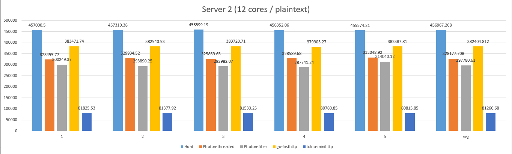

# Hunt library
A refined core library for D programming language.

## Modules
 * hunt.event
 * hunt.io
 * hunt.logging
 * hunt.util

## Platforms
 * FreeBSD
 * Windows
 * macOS
 * Linux
 * Android

## Libraries
 * [hunt-net](https://github.com/huntlabs/hunt-net) – An asynchronous event-driven network library written in D.

## Frameworks
 * [hunt-framework](https://github.com/huntlabs/hunt-framework) – Hunt is a high-level D Programming Language Web framework that encourages rapid development and clean, pragmatic design. It lets you build high-performance Web applications quickly and easily.

## Requirements
D Compiler 2.088+.

## Avaliable versions
| Identifier | Description | 
|--------|--------|
| HUNT_DEBUG |  Used to log some debug messages |

## Benchmarks

For details, see [here](docs/benchmark.md).

## Thanks
 * @Cogitri
 * @deviator
 * @jasonwhite
 * @Kripth
 * @n8sh
 * @shove70

## TODO
- [ ] Better performance
- [ ] Better APIs
- [ ] Improvement for Worker with IOCP
