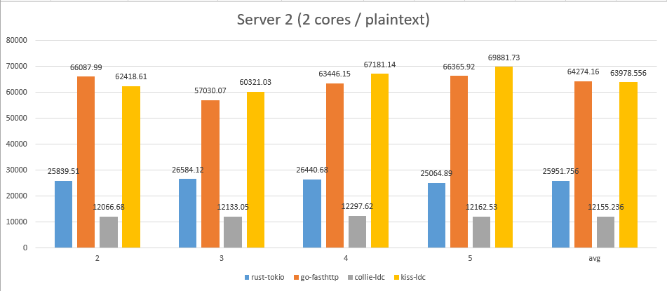

# Hunt library
A refined core library for D programming language.

## Modules
 * hunt.io ( TcpListener / TcpStream )
 * hunt.container (Java alike)
 * hunt.event ( kqueue / epoll / iocp )
 * hunt.logging
 * hunt.math (BigIngeger etc.)
 * hunt.util (buffer configration memory radix-tree serialize string timer etc.)

## Platforms
 * FreeBSD
 * Windows
 * OSX
 * Linux
 * NetBSD
 * OpenBSD

## Libraries
 * [hunt-net](https://github.com/huntlabs/hunt-net) – An asynchronous event-driven network framework written in D.

## Frameworks
 * [hunt-framework](https://github.com/huntlabs/hunt-framework) – Hunt is a high-level D Programming Language Web framework that encourages rapid development and clean, pragmatic design. It lets you build high-performance Web applications quickly and easily.

## Benchmarks

For details, see [here](docs/benchmark.md).

## TODO
- [ ] Improve performance
- [ ] Stablize APIs
- [ ] More friendly APIs
- [ ] More examples
- [ ] More common utils
- [x] Benchmark test
- [x] Improve supports on Mac OS
