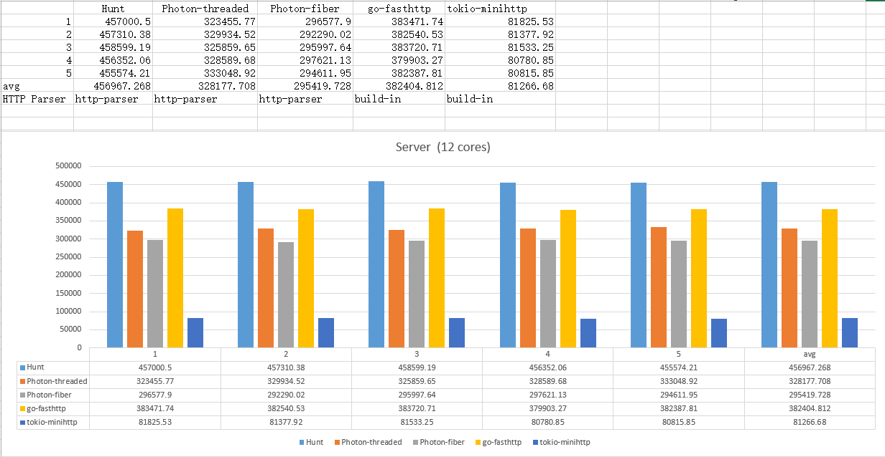

## Hunt Benchmark

### Environment
- **Server** (physical server / 12 cores): SMP Debian 3.16.7 x86_64 GNU/Linux

### Compilers
- **DMD:** 2.083
- **GO:**  v1.10.1
- **Rust:** v1.25.0

### Tools
- **wrk:** v4.1.0
- **bash script:** [../examples/Benchmark/bench.sh](../examples/Benchmark/bench.sh)
- **command line:** `$ ./bench.sh Hunt plaintext 127.0.0.1 8080`

### Benchmarking (plaintext)

#### case one
The Date field in http header is set

[The logs](logs/b1/)

#### case two
Just repson with static string.

[The logs](logs/b2/)

### See also

[1] Hunt: https://github.com/huntlabs/hunt/

[2] Photon: https://github.com/DmitryOlshansky/photon/

[3] Tokio MiniHTTP: https://github.com/tokio-rs/tokio-minihttp/

[4] fasthttp: https://github.com/valyala/fasthttp/

[5] FrameworkBenchmarks: https://github.com/TechEmpower/FrameworkBenchmarks/

[6] wrk: https://github.com/wg/wrk/
