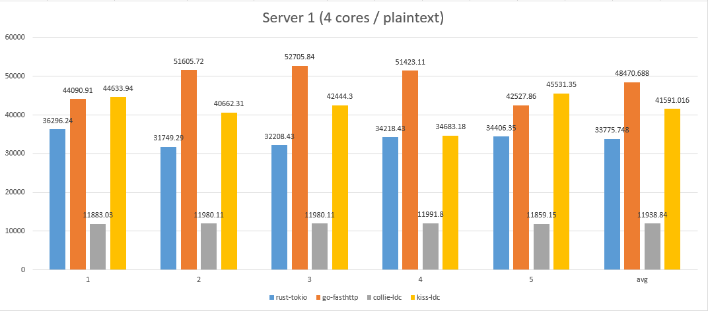

## Kiss Benchmark

### Environment
- **Server 1** (virtual machine / 4 cores): Ubuntu SMP x86_64 GNU/Linux
- **Server 2** (physical server / 2 cores): SMP Debian 3.16.7 x86_64 GNU/Linux

### Compilers
- **DMD:** v2.077.1
- **LDC:** v1.9.0
- **GO:**  v1.10.1
- **Rust:** v1.25.0

### Tools
- **wrk:** v4.1.0
- **bash script:** [../examples/Benchmark/bench.sh](../examples/Benchmark/bench.sh)
- **command line:** `$ ./bench.sh Kiss plaintext 10.1.x.x 8080`

### Benchmarking (plaintext)

#### Server 1

[All the logs](logs/b1/)

#### Server 2

[All the logs](logs/b2/)

### Benchmarking (json)

#### Server 1

[All the logs](logs/b1/)

#### Server 2

[All the logs](logs/b2/)

### See also

[1] Collie: https://github.com/huntlabs/collie/

[2] Tokio MiniHTTP: https://github.com/tokio-rs/tokio-minihttp/

[3] fasthttp: https://github.com/valyala/fasthttp/

[4] FrameworkBenchmarks: https://github.com/TechEmpower/FrameworkBenchmarks/

[5] wrk: https://github.com/wg/wrk/
